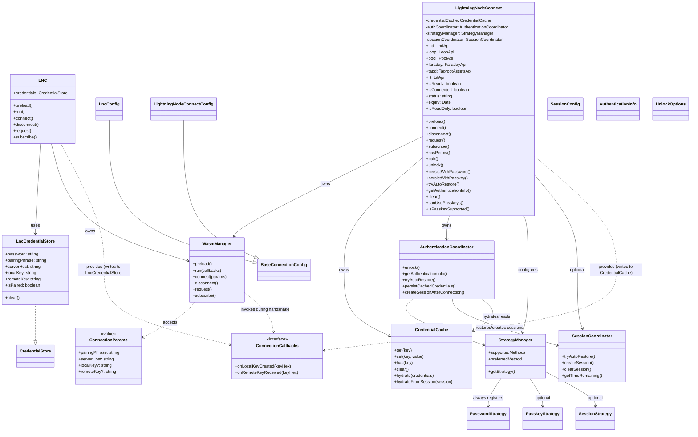

# Split Legacy `LNC` From Modern `LightningNodeConnect`

## Summary

- Restore `LNC` to the exact post-`WasmManager` role from commit `44a844c88adb9bb692fa70b46e8f33a74cbd3768`: password-only, public `credentials`, and no passkey/session/auth-orchestration API.
- Introduce a separate `LightningNodeConnect` class as the modern entrypoint for password + passkeys + sessions, with password always available and passkeys/sessions enabled by default unless opted out.
- Keep the package default export as legacy `LNC`. Export `LightningNodeConnect` as a named export. Do not add a named `LNC` alias or other migration helpers in this refactor.

## Public API Changes

- Split config and auth/session types into legacy and modern modules while keeping shared connection fields defined once in a neutral base type.
  - `LncConfig = BaseConnectionConfig + { password?: string; credentialStore?: CredentialStore }`
  - `LightningNodeConnectConfig = BaseConnectionConfig + { allowPasskeys?: boolean; enableSessions?: boolean; passkeyDisplayName?: string; session?: SessionConfig }`
- Restore `[lib/types/lnc.ts](/Users/jamal/dev/lightninglabs/dev-resources/frontend-regtest/repos/lnc-web/lib/types/lnc.ts)` to legacy-only surface types:
  - `LncConfig`
  - `CredentialStore`
  - `WasmGlobal`
- Move modern-only types into a new file for `LightningNodeConnect`:
  - `AuthenticationInfo`
  - `UnlockMethod`
  - `UnlockOptions`
  - `SessionConfig`
  - `ClearOptions`
- `LNC` public surface becomes exactly the old facade:
  - `credentials`
  - `preload`, `run`, `connect`, `disconnect`, `waitTilReady`, `request`, `subscribe`
  - connection/status getters and RPC service fields
  - no `pair`, `unlock`, `persistWithPassword`, `persistWithPasskey`, `tryAutoRestore`, `getAuthenticationInfo`, `canUsePasskeys`, `clear`, or `clearCredentials`
  - no static `isPasskeySupported()`
- `LightningNodeConnect` public surface:
  - lifecycle methods: `preload`, `connect`, `disconnect` (`run` and `waitTilReady` are private — `connect` handles WASM loading internally)
  - RPC methods: `request`, `subscribe`
  - status getters: `isReady`, `isConnected`, `status`, `expiry`, `isReadOnly`, `hasPerms()`
  - RPC service fields: `lnd`, `loop`, `pool`, `faraday`, `tapd`, `lit`
  - auth methods: `pair`, `unlock`, `persistWithPassword`, `persistWithPasskey`, `tryAutoRestore`, `getAuthenticationInfo`, `clear`, `canUsePasskeys`
  - no public `credentials` object and no `clearCredentials` alias
  - `tryAutoRestore()` restores session/auth state only; it never calls `connect()`
  - static `isPasskeySupported()` remains available on the modern class

## Architecture Diagram

## Class / Type Summary

- `LNC`: legacy public facade that goes back to password-only behavior and continues exposing the old public `credentials` object.
- `LightningNodeConnect`: modern public facade for password, passkeys, and sessions without legacy compatibility constraints.
- `WasmManager`: shared transport/runtime layer that loads the WASM client, manages connection state, and serves RPC requests for both entrypoints. Takes `ConnectionParams` (plain data) and `ConnectionCallbacks` (key-update hooks) instead of storing a mutable credential provider. Has no post-connect cleanup logic — each entrypoint manages its own credential lifecycle.
- `ConnectionParams`: plain value object (`pairingPhrase`, `serverHost`, `localKey?`, `remoteKey?`) passed to `WasmManager.connect()`. Built from `LncCredentialStore` by `LNC` or from `CredentialCache` by `LightningNodeConnect`.
- `ConnectionCallbacks`: callback interface (`onLocalKeyCreated`, `onRemoteKeyReceived`) that `WasmManager` invokes during the WASM handshake. Each entrypoint provides its own callbacks to write keys back to the appropriate store.
- `LncCredentialStore`: legacy credential persistence object used only by `LNC` for password-backed key storage. `LNC` provides `ConnectionCallbacks` that write keys directly into this store.
- `CredentialCache`: existing in-memory credential cache (`Map<string, string>`) reused by `LightningNodeConnect` as the single source of truth for connection state. `LightningNodeConnect` provides `ConnectionCallbacks` that write keys into this cache, keeping WASM-generated keys and auth-stack state in sync without an adapter layer.
- `AuthenticationCoordinator`: modern auth orchestrator responsible for unlock (side-effect-free), auth-state inspection, session restore, explicit persistence of cached credentials via `persistCachedCredentials()`, and explicit session creation via `createSessionAfterConnection()`. After this refactor, `createSessionAfterConnection()` is session-only and no longer writes long-term persisted credentials.
- `StrategyManager`: registry/factory for the enabled authentication strategies and the logic that selects supported and preferred unlock methods.
- `SessionCoordinator`: wrapper around session lifecycle behavior so session restore/creation stays explicit and optional.
- `PasswordStrategy`: modern password-based credential unlock/persistence path.
- `PasskeyStrategy`: modern passkey-based credential unlock/persistence path.
- `SessionStrategy`: modern session-restore unlock path used only when sessions are enabled.
- `BaseConnectionConfig`: shared connection options used by both legacy and modern entrypoints.
- `LncConfig`: legacy constructor config containing only connection fields plus password and optional custom `CredentialStore`.
- `LightningNodeConnectConfig`: modern constructor config containing connection fields plus `allowPasskeys`, `enableSessions`, `passkeyDisplayName`, and `session` settings.
- `CredentialStore`: legacy public storage contract kept only for `LNC` compatibility.
- `SessionConfig`: modern session behavior options such as duration and refresh policy.
- `AuthenticationInfo`: modern read model returned to the app to describe current auth/session availability and recommended unlock method.
- `UnlockOptions`: discriminated union describing the supported modern unlock flows (`password`, `passkey`, `session`).

## Implementation Changes

- Change `[lib/api/createRpc.ts](/Users/jamal/dev/lightninglabs/dev-resources/frontend-regtest/repos/lnc-web/lib/api/createRpc.ts)` to accept a structural client type with `request` and `subscribe`, not concrete `LNC`.
- Rebuild `[lib/lnc.ts](/Users/jamal/dev/lightninglabs/dev-resources/frontend-regtest/repos/lnc-web/lib/lnc.ts)` to match `44a844c` behavior while keeping current non-behavioral improvements that do not affect the public contract:
  - use `LncCredentialStore` or supplied `credentialStore`
  - own `WasmManager` directly
  - provide `ConnectionCallbacks` that write keys into `this.credentials` (`onLocalKeyCreated` → `this.credentials.localKey = keyHex`, `onRemoteKeyReceived` → `this.credentials.remoteKey = keyHex`)
  - build `ConnectionParams` from `this.credentials` when calling `connect()`
  - handle legacy post-connect cleanup in `LNC` itself: if `this.credentials.password` is set after connection, call `this.credentials.clear(true)` to clear in-memory keys (this logic moves out of `WasmManager`)
  - remove all imports/usages of `CredentialOrchestrator`, unified store, passkey services, and session types
- Add `[lib/lightningNodeConnect.ts](/Users/jamal/dev/lightninglabs/dev-resources/frontend-regtest/repos/lnc-web/lib/lightningNodeConnect.ts)` as the modern facade:
  - own `WasmManager` directly
  - be the composition root for the modern auth path
  - wire `StrategyManager`, `AuthenticationCoordinator`, and optional `SessionCoordinator` without recreating a compatibility-style orchestrator
  - reuse the existing `CredentialCache` from `lib/stores/credentialCache.ts` as the single in-memory store for connection state; do not create a separate adapter or duplicate store
  - provide `ConnectionCallbacks` that write keys directly into `CredentialCache` (`onLocalKeyCreated` → `credentialCache.set('localKey', keyHex)`, `onRemoteKeyReceived` → `credentialCache.set('remoteKey', keyHex)`)
  - build `ConnectionParams` from `CredentialCache` when calling `connect()` — no mutable provider object needed
  - no post-connect credential cleanup is needed; the modern path manages credential lifecycle explicitly through `AuthenticationCoordinator`
  - wire all 6 RPC services (`lnd`, `loop`, `pool`, `faraday`, `tapd`, `lit`) via `createRpc(packageName, this)`, identical to how `LNC` wires them; this works because `LightningNodeConnect` exposes `request()` and `subscribe()` methods that satisfy the `RpcClient` structural type
  - expose the same status getters as `LNC`: `isReady`, `isConnected`, `status`, `expiry`, `isReadOnly`, `hasPerms()`
  - `pair()` keeps current behavior: set pairing phrase on `CredentialCache`, set `serverHost` from config defaults if not already set, then `connect()` (`run()` remains an optional preload hook, not a required consumer step)
  - `persistWithPassword()` and `persistWithPasskey()` remain explicit post-pair persistence steps
- Remove `CredentialOrchestrator` and `UnifiedCredentialStore` from the runtime architecture and public exports once `LightningNodeConnect` owns the modern path directly.
- Update the modern auth stack so capability registration is modern-first:
  - password strategy always registered
  - passkey strategy registered unless `allowPasskeys === false`
  - session strategy/coordinator created only when `enableSessions !== false`
  - `unlock()` only authenticates and hydrates in-memory auth state; it does not persist credentials or create/update sessions — specifically, the existing `persistCachedCredentials()` and `tryCreateSession()` calls inside `AuthenticationCoordinator.unlock()` must be removed so unlock is side-effect-free
  - `AuthenticationCoordinator.persistCachedCredentials()` becomes a public method so `LightningNodeConnect` can call it explicitly from `persistWithPassword()` / `persistWithPasskey()` after unlocking the chosen persistence strategy
  - `AuthenticationCoordinator.createSessionAfterConnection()` remains separate and becomes session-only; `LightningNodeConnect` calls it explicitly after persistence when sessions are enabled
  - session creation/restoration remains an explicit modern flow; no implicit session creation during `unlock()`
  - disabled capability calls fail predictably:
    - `unlock({ method: 'passkey' })` returns `false` when passkeys are disabled
    - `unlock({ method: 'session' })` returns `false` when sessions are disabled or unavailable
    - `canUsePasskeys()` only reports runtime support when passkeys are enabled in config
- Update `demos/passkeys-demo` to instantiate `LightningNodeConnect` while preserving the current UX flow:
  - app explicitly checks auth info / tries session restore
  - if restore fails, app prompts for password or passkey depending on stored state
  - `connect()` remains a separate explicit step after auth
  - change only the hook/import seam unless the new class forces broader updates
- Leave `demos/connect-demo` and legacy examples on `LNC`.

## Breaking Changes To Call Out

- These breaking changes are intentional.
- They are low risk for external consumers because the modern passkey/session-compatible `LNC` surface has not been released publicly yet; this refactor is correcting the API shape before that architecture becomes part of the supported contract.

- Restoring `LNC` to the `44a844c` shape removes:
  - `pair()`
  - `unlock()`
  - `persistWithPassword()`
  - `persistWithPasskey()`
  - `tryAutoRestore()`
  - `getAuthenticationInfo()`
  - `supportsPasskeys()` on `LNC` (renamed to `canUsePasskeys()` on modern class)
  - session/passkey config on `LncConfig`
- Legacy replacement for `lnc.pair(pairingPhrase)` usage:
  - `lnc.credentials.pairingPhrase = pairingPhrase`
  - `await lnc.connect()`
  - `await lnc.run()` remains optional if the app wants eager WASM loading before `connect()`
- Removing `enableSessions`, `sessionConfig`, `allowPasskeys`, and `passkeyDisplayName` from `LncConfig` is a breaking change for any consumer currently using those options on `LNC`.

## Test Plan

- Legacy regression tests in `[lib/lnc.test.ts](/Users/jamal/dev/lightninglabs/dev-resources/frontend-regtest/repos/lnc-web/lib/lnc.test.ts)`:
  - `LNC` exposes `credentials` and transport/RPC methods only
  - `LNC` uses `LncCredentialStore` directly and honors custom `credentialStore`
  - `LNC` provides `ConnectionCallbacks` that write keys into `this.credentials`
  - password persistence still works through `lnc.credentials.password`
  - no passkey/session-specific behavior is exercised through `LNC`
  - `LNC` no longer exposes static `isPasskeySupported()`
- New modern tests in a dedicated `lightningNodeConnect` suite:
  - default config enables password + passkeys + sessions
  - opt-out disables passkeys and/or sessions, but never password
  - `tryAutoRestore()` restores session state without invoking `WasmManager.connect()`
  - `unlock({ method: 'session' | 'password' | 'passkey' })` updates auth state correctly without persisting credentials or creating sessions as a side effect
  - `unlock()` returns `false` for disabled/unavailable methods
  - `pair()` + `persistWithPassword()` and `pair()` + `persistWithPasskey()` preserve current behavior
  - `pair()` sets `serverHost` on `CredentialCache` from config defaults when not already set
  - `clear({ session, persisted })` affects only modern auth/session data as specified
  - `WasmManager` receives `ConnectionCallbacks` that write keys into `CredentialCache`, keeping WASM-generated keys and auth-stack state in sync
  - RPC services (`lnd`, `loop`, `pool`, `faraday`, `tapd`, `lit`) are wired and route through `request()` / `subscribe()`
  - status getters (`isReady`, `isConnected`, `status`, `expiry`, `isReadOnly`, `hasPerms()`) delegate to `WasmManager`
  - `canUsePasskeys()` returns `false` when passkeys are disabled even if the browser supports them
  - static `LightningNodeConnect.isPasskeySupported()` exists and remains wired correctly
- Export/type tests:
  - package default export is still `LNC`
  - named export `LightningNodeConnect` exists
  - no named export `LNC` is added
  - legacy and modern types resolve from the correct modules
  - `createRpc` works with both entrypoints
- Demo verification:
  - repo demos are wired to consume the local package under development, not the published registry version
  - `passkeys-demo` keeps the same route-level UX and explicit restore/login/connect flow
  - `connect-demo` still builds against legacy `LNC`
- Run `yarn test`, `yarn typecheck`, and `yarn build` after the refactor.

## Assumptions

- Keep the current operational defaults such as the current WASM URL and server host unless a specific test shows the older values are required; “revert `LNC`” applies to class role and API, not CDN/version strings.
- No migration guide, deprecation path, or package-default switch is included in this refactor.
- The modern class is intentionally a clean break: no public `CredentialStore`, no legacy alias methods, and no requirement to preserve legacy constructor semantics.
- If the modern path needs one private helper to encapsulate auth lifecycle, that is acceptable as long as it is modern-only and not part of the public API.
