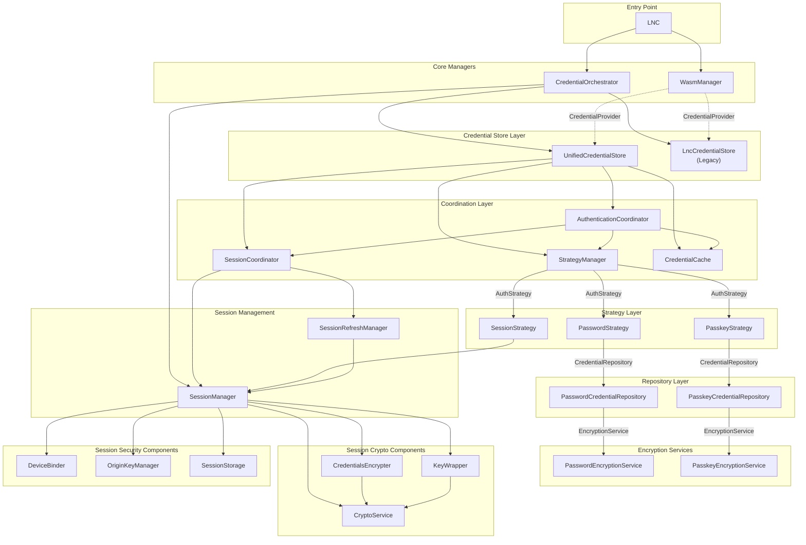

# LNC-Web Architecture Diagram

This document shows the class relationships with the UnifiedCredentialStore that supports session-based authentication with password or paaskeys.

## Class Dependency Diagram



## Layer Overview

### Entry Point

- **LNC**: Main entry point for the library. Provides high-level API for Lightning Network operations.

### Core Managers

- **WasmManager**: Manages WebAssembly client lifecycle, connection, and RPC communication.
- **CredentialOrchestrator**: Orchestrates credential management, decides which credential store to use based on configuration.

### Credential Store Layer

- **UnifiedCredentialStore**: New credential store supporting multiple authentication strategies (password, passkey, session).
- **LncCredentialStore**: Legacy credential store for backward compatibility.

### Coordination Layer

- **AuthenticationCoordinator**: Coordinates authentication operations across strategies, handles unlock logic and credential persistence.
- **SessionCoordinator**: Coordinates session-related operations and lifecycle management.
- **StrategyManager**: Manages authentication strategies and their lifecycle.
- **CredentialCache**: In-memory credential storage for fast access during session lifecycle.

### Strategy Layer (Strategy Pattern)

- **AuthStrategy**: Interface for authentication strategies.
- **PasswordStrategy**: Password-based authentication using AES encryption.
- **PasskeyStrategy**: WebAuthn passkey-based authentication using PRF extension.
- **SessionStrategy**: Session-based authentication for passwordless reconnection.

### Repository Layer (Repository Pattern)

- **CredentialRepository**: Interface for credential storage.
- **PasswordCredentialRepository**: Stores encrypted credentials in localStorage using password encryption.
- **PasskeyCredentialRepository**: Stores encrypted credentials in localStorage using passkey-derived keys.

### Encryption Services

- **EncryptionService**: Interface for encryption operations.
- **PasswordEncryptionService**: AES encryption using password + salt with PBKDF2.
- **PasskeyEncryptionService**: AES-GCM encryption using WebAuthn PRF extension for key derivation.

### Session Management

- **SessionManager**: Handles creation, restoration, and management of passwordless sessions with device binding.
- **SessionRefreshManager**: Monitors user activity and automatically extends sessions.

### Session Crypto Components

- **CryptoService**: Core crypto operations (AES-GCM encryption, key wrapping).
- **CredentialsEncrypter**: Encrypts/decrypts session credentials.
- **KeyWrapper**: Wraps credentials key with device and origin keys for double protection.

### Session Security Components

- **DeviceBinder**: Generates device fingerprints and derives device-bound session keys.
- **OriginKeyManager**: Manages origin-bound keys stored in IndexedDB.
- **SessionStorage**: Handles session data persistence in sessionStorage.

## Data Flow

### Initial Connection (New User)

```
LNC.pair() → WasmManager.pair() → WasmManager.connect()
    ↓
LNC.persistWithPassword() / LNC.persistWithPasskey()
    ↓
CredentialOrchestrator → UnifiedCredentialStore.unlock()
    ↓
StrategyManager → PasswordStrategy/PasskeyStrategy
    ↓
PasswordCredentialRepository / PasskeyCredentialRepository
    ↓
PasswordEncryptionService / PasskeyEncryptionService
```

### Session Restoration (Returning User)

```
UnifiedCredentialStore.tryAutoRestore()
    ↓
AuthenticationCoordinator → SessionCoordinator → SessionManager.tryRestore()
    ↓
DeviceBinder (verify fingerprint) → OriginKeyManager (load key)
    ↓
KeyWrapper (unwrap credentials key) → CredentialsEncrypter (decrypt)
    ↓
CredentialCache (hydrate) → Ready for LNC.connect()
```

### Authentication Unlock

```
LNC.unlock({ method: 'password' | 'passkey' | 'session' })
    ↓
CredentialOrchestrator → UnifiedCredentialStore.unlock()
    ↓
AuthenticationCoordinator → StrategyManager.getStrategy()
    ↓
[PasswordStrategy | PasskeyStrategy | SessionStrategy].unlock()
    ↓
Repository → EncryptionService → Credentials loaded to cache
```
